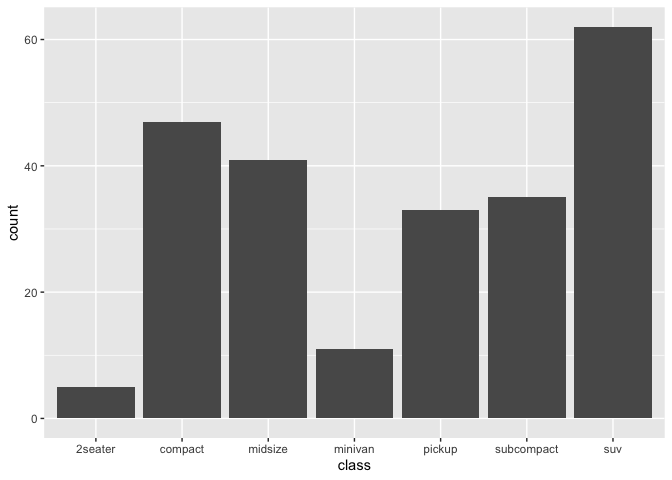
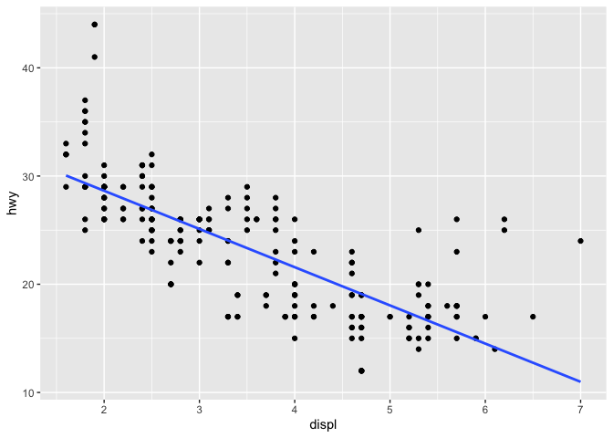
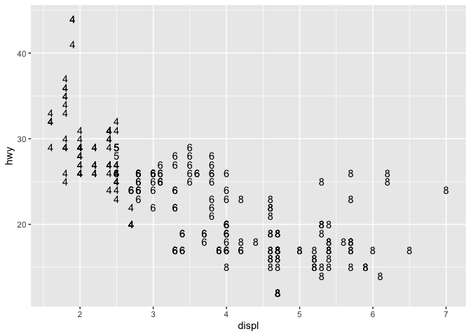
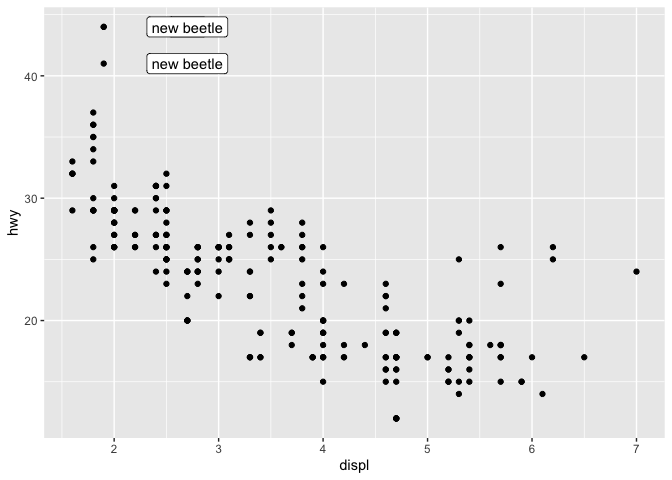

  


<br>

## Readings  

**Required**:  

* [Chapter 3.1-3.6 in Grolemund and Wickham's R for Data Science](https://r4ds.had.co.nz/data-visualisation.html)  

**Additional resources**:  

* [RStudio's ggplot2 cheat sheet](https://github.com/rstudio/cheatsheets/blob/master/data-visualization-2.1.pdf)  

<br>  

## Learning objectives

By the end of this class you will be able to:

* Inspect your data in RStudio  
* Build several common types of graphs in `ggplot2`  
* Customize `ggplot2` aesthetics  
* Combine compatible graph types  
* Split up data into faceted graphs  
* Change the theme of graphs  
* Get more comfortable with sharing your work through GitHub

**Acknowledgements**: Some content from today's lecture is adapted from the excellent [R for Excel users](https://rstudio-conf-2020.github.io/r-for-excel/) course by Julia Stewart Lowndes and Allison Horst and the [R for Data Science](https://r4ds.had.co.nz/data-visualisation.html) book by Garrett Grolemund and Hadley Wickham.

<br>  

## A note on weekly assignments

Each week's assignment will be finalized before Monday's lecture that week. [Assignment 2](https://nt246.github.io/NTRES6940-data-science/assignments.html#assignment_2) is now finalized and is due by 10pm next Monday. 

<br>  

## Create an RMarkdown file for note taking in this lecture

Before we start, please open the R Project that you created in our last lecture that is associated with your personal GitHub repository. Then create a new RMarkdown file, select `github_document` output format, and save it to your lecture note folder. You will use this RMarkdown file to take notes and work on exercises, and to share your work with the class. 

<br>  

## Load packages


```r
library(tidyverse)
```

<br>  

## The grammar of graphics in `ggplot2`

In this class, we will write reproducible code to build graphs piece-by-piece. In Excel, graphs are made by manually selecting options, which may not be the best option for keeping track of our work. Also, if we haven't built a graph with reproducible code, we might not be able to easily recreate a graph or use that code again to make the same style graph with different data.

Using `ggplot2`, the graphics package within the `tidyverse`, we will write reproducible code to manually and thoughtfully build our graphs.

> “ggplot2 implements the grammar of graphics, a coherent system for describing and building graphs. With ggplot2, you can do more faster by learning one system and applying it in many places.” - R4DS

So yeah…that `gg` is from “grammar of graphics.”


These "same few components" that all `ggplot2` graphs share include the followings:


Of these, **data**, **aethetics**, and **geometries** are the components that must be specified when creating a graph.

We will use the `ggplot2` package, but the function we use to initialize a graph will be `ggplot`, which works best for data in tidy format (i.e., a column for every variable, and a row for every observation). We will learn more about the tidy format and how to convert "untidy" datasets into tidy format later in the class. For the purpose of this class, the datasets that we will use are already in tidy format. 

Graphics with `ggplot2` are built step-by-step, adding new elements as layers with a plus sign (`+`) between layers. Adding layers in this fashion allows for extensive flexibility and customization of plots. Below is a template that can be used to create almost any graph that you can imagine using `ggplot2`.

```
ggplot(data = <DATA>) + 
  <GEOM_FUNCTION>(
     mapping = aes(<MAPPINGS>),
     stat = <STAT>, 
     position = <POSITION>
  ) +
  <COORDINATE_FUNCTION> +
  <FACET_FUNCTION> +
  <THEME_FUNCTION>
```

Breaking that down:

* First, tell R you are using `ggplot()`  
* Then, tell it the object name under which your data table is stored (`data = <DATA>`)  
* Next, add a layer for the type of geometric object with `<GEOM_FUNCTION>`. For example, geom_point() generates a scatterplot, geom_line() generates a line graph, geom_bar() generates a bar graph, etc.  
* Then, use `mapping = aes(<MAPPINGS>)` to specify which variables you want to plot in this layer and which aesthetics they should map to.
* (Optional) Use `stat = <STAT>` to perform statistical transformation with your variables.
* (Optional) Use `position = <POSITION>` to perform any position adjustment with your geometric object.
* (Optional) Use `<COORDINATE_FUNCTION>` to change the default coordinate system.
* (Optional) Use `<FACET_FUNCTION>` to make a faceted graph.
* (Optional) Use `<THEME_FUNCTION>` to change the default style of the graph.

<br>  

## Activity: break down the following graphs into basic `ggplot2` components

* Manhattan plot


* Ridgeline plot


* Line plot


* Bar plot


<br>  

## Create our first `ggplot2` graph

We will visualize some fuel economy data for 38 popular models of car using the dataset `mpg` which is included in the `ggplot2` package. 

#### Inspect the data frame

Before making any kind of graph, we will always need to know our data first. In R, data tables are most often stored as an object of the class `data.frame`. There are a few different ways to inspect these data tables. 

* Directly type the name of the data frame
    
    This method works well if you run it from RMardown. If ran on R Console or if knitted on RMardkown, it can still do a good job with small data frames, or with data frames that are of the class `tibble`. (We will learn more about `tibble` later in class. For now, just think of it as an upgraded type of data frame.) 
    
    But, if you do it with a larger, non-`tibble` data frame, it will attempt print the entire data frame on your console or your knitted output, making the result very difficult to read. 
    
    
    ```r
    ## demo (compare and contrast regular data frame and tibble)
    mpg
    ```
    
    ```
    ## # A tibble: 234 x 11
    ##    manufacturer model    displ  year   cyl trans   drv     cty   hwy fl    class
    ##    <chr>        <chr>    <dbl> <int> <int> <chr>   <chr> <int> <int> <chr> <chr>
    ##  1 audi         a4         1.8  1999     4 auto(l… f        18    29 p     comp…
    ##  2 audi         a4         1.8  1999     4 manual… f        21    29 p     comp…
    ##  3 audi         a4         2    2008     4 manual… f        20    31 p     comp…
    ##  4 audi         a4         2    2008     4 auto(a… f        21    30 p     comp…
    ##  5 audi         a4         2.8  1999     6 auto(l… f        16    26 p     comp…
    ##  6 audi         a4         2.8  1999     6 manual… f        18    26 p     comp…
    ##  7 audi         a4         3.1  2008     6 auto(a… f        18    27 p     comp…
    ##  8 audi         a4 quat…   1.8  1999     4 manual… 4        18    26 p     comp…
    ##  9 audi         a4 quat…   1.8  1999     4 auto(l… 4        16    25 p     comp…
    ## 10 audi         a4 quat…   2    2008     4 manual… 4        20    28 p     comp…
    ## # … with 224 more rows
    ```
    
    ```r
    cars
    ```
    
    ```
    ##    speed dist
    ## 1      4    2
    ## 2      4   10
    ## 3      7    4
    ## 4      7   22
    ## 5      8   16
    ## 6      9   10
    ## 7     10   18
    ## 8     10   26
    ## 9     10   34
    ## 10    11   17
    ## 11    11   28
    ## 12    12   14
    ## 13    12   20
    ## 14    12   24
    ## 15    12   28
    ## 16    13   26
    ## 17    13   34
    ## 18    13   34
    ## 19    13   46
    ## 20    14   26
    ## 21    14   36
    ## 22    14   60
    ## 23    14   80
    ## 24    15   20
    ## 25    15   26
    ## 26    15   54
    ## 27    16   32
    ## 28    16   40
    ## 29    17   32
    ## 30    17   40
    ## 31    17   50
    ## 32    18   42
    ## 33    18   56
    ## 34    18   76
    ## 35    18   84
    ## 36    19   36
    ## 37    19   46
    ## 38    19   68
    ## 39    20   32
    ## 40    20   48
    ## 41    20   52
    ## 42    20   56
    ## 43    20   64
    ## 44    22   66
    ## 45    23   54
    ## 46    24   70
    ## 47    24   92
    ## 48    24   93
    ## 49    24  120
    ## 50    25   85
    ```

* `View()`

    `View()` opens up a spreadsheet-style data viewer. The resulting spreadsheet can be sorted by clicking the column names. It is good for exploring the dataset, but you should not run `View()` when knitting a RMarkdown file.
    
    Why do you think that is? Try typing `View(mpg)` in a code chunk in RMarkdown, knit it, and see what happens. 
    
    
    ```r
    ## exercise, then demo (knit with View() in code chunk)
    ## View(mpg)
    ```
  
* `head()` and `tail()`
    
    `head()` and `tail()` can be used to check the first and last few rows of a data frame. 
    
    
    ```r
    ## demo
    head(mpg)
    ```
    
    ```
    ## # A tibble: 6 x 11
    ##   manufacturer model displ  year   cyl trans      drv     cty   hwy fl    class 
    ##   <chr>        <chr> <dbl> <int> <int> <chr>      <chr> <int> <int> <chr> <chr> 
    ## 1 audi         a4      1.8  1999     4 auto(l5)   f        18    29 p     compa…
    ## 2 audi         a4      1.8  1999     4 manual(m5) f        21    29 p     compa…
    ## 3 audi         a4      2    2008     4 manual(m6) f        20    31 p     compa…
    ## 4 audi         a4      2    2008     4 auto(av)   f        21    30 p     compa…
    ## 5 audi         a4      2.8  1999     6 auto(l5)   f        16    26 p     compa…
    ## 6 audi         a4      2.8  1999     6 manual(m5) f        18    26 p     compa…
    ```
    
    ```r
    tail(mpg)
    ```
    
    ```
    ## # A tibble: 6 x 11
    ##   manufacturer model  displ  year   cyl trans     drv     cty   hwy fl    class 
    ##   <chr>        <chr>  <dbl> <int> <int> <chr>     <chr> <int> <int> <chr> <chr> 
    ## 1 volkswagen   passat   1.8  1999     4 auto(l5)  f        18    29 p     midsi…
    ## 2 volkswagen   passat   2    2008     4 auto(s6)  f        19    28 p     midsi…
    ## 3 volkswagen   passat   2    2008     4 manual(m… f        21    29 p     midsi…
    ## 4 volkswagen   passat   2.8  1999     6 auto(l5)  f        16    26 p     midsi…
    ## 5 volkswagen   passat   2.8  1999     6 manual(m… f        18    26 p     midsi…
    ## 6 volkswagen   passat   3.6  2008     6 auto(s6)  f        17    26 p     midsi…
    ```

* `?`
    
    If the data frame included in an R package, typing `?data frame_name` will lead you to a help file with more information on the data frame.
    
* `str()`, `is()`, `dim()`, `colnames()`, `summary()`

    These functions return important information on the data frame and are particularly helpful when inspecting larger data frames. Give them a try and see what they do. 
    
    
    ```r
    ## exercise, then demo
    str(mpg)
    ```
    
    ```
    ## Classes 'tbl_df', 'tbl' and 'data.frame':	234 obs. of  11 variables:
    ##  $ manufacturer: chr  "audi" "audi" "audi" "audi" ...
    ##  $ model       : chr  "a4" "a4" "a4" "a4" ...
    ##  $ displ       : num  1.8 1.8 2 2 2.8 2.8 3.1 1.8 1.8 2 ...
    ##  $ year        : int  1999 1999 2008 2008 1999 1999 2008 1999 1999 2008 ...
    ##  $ cyl         : int  4 4 4 4 6 6 6 4 4 4 ...
    ##  $ trans       : chr  "auto(l5)" "manual(m5)" "manual(m6)" "auto(av)" ...
    ##  $ drv         : chr  "f" "f" "f" "f" ...
    ##  $ cty         : int  18 21 20 21 16 18 18 18 16 20 ...
    ##  $ hwy         : int  29 29 31 30 26 26 27 26 25 28 ...
    ##  $ fl          : chr  "p" "p" "p" "p" ...
    ##  $ class       : chr  "compact" "compact" "compact" "compact" ...
    ```
    
    ```r
    is(mpg)
    ```
    
    ```
    ## [1] "tbl_df"     "tbl"        "data.frame" "list"       "oldClass"  
    ## [6] "vector"
    ```
    
    ```r
    dim(mpg)
    ```
    
    ```
    ## [1] 234  11
    ```
    
    ```r
    colnames(mpg)
    ```
    
    ```
    ##  [1] "manufacturer" "model"        "displ"        "year"         "cyl"         
    ##  [6] "trans"        "drv"          "cty"          "hwy"          "fl"          
    ## [11] "class"
    ```
    
    ```r
    summary(mpg)
    ```
    
    ```
    ##  manufacturer          model               displ            year     
    ##  Length:234         Length:234         Min.   :1.600   Min.   :1999  
    ##  Class :character   Class :character   1st Qu.:2.400   1st Qu.:1999  
    ##  Mode  :character   Mode  :character   Median :3.300   Median :2004  
    ##                                        Mean   :3.472   Mean   :2004  
    ##                                        3rd Qu.:4.600   3rd Qu.:2008  
    ##                                        Max.   :7.000   Max.   :2008  
    ##       cyl           trans               drv                 cty       
    ##  Min.   :4.000   Length:234         Length:234         Min.   : 9.00  
    ##  1st Qu.:4.000   Class :character   Class :character   1st Qu.:14.00  
    ##  Median :6.000   Mode  :character   Mode  :character   Median :17.00  
    ##  Mean   :5.889                                         Mean   :16.86  
    ##  3rd Qu.:8.000                                         3rd Qu.:19.00  
    ##  Max.   :8.000                                         Max.   :35.00  
    ##       hwy             fl               class          
    ##  Min.   :12.00   Length:234         Length:234        
    ##  1st Qu.:18.00   Class :character   Class :character  
    ##  Median :24.00   Mode  :character   Mode  :character  
    ##  Mean   :23.44                                        
    ##  3rd Qu.:27.00                                        
    ##  Max.   :44.00
    ```
    
    
#### Simple scatter plot

Let's first make a simple scatter plot to look at how engine displacement (`displ`), which is an expression of an engine's size, may affect the fuel economy of cars on highway (`hwy`). For this plot, what are the aesthetics, and what are the geometric objects? 


```r
## demo
ggplot(data = mpg) + 
  geom_point(mapping = aes(x=displ, y=hwy)) 
```

<!-- -->

#### Make the size of points corresponds to the number of cylinders (`cyl`), and the color of points corresponds to the type of car (`class`)

The scatter plot shows that there is a negative correlation between engine size and fuel economy. However, there are a few points that show up as outliers of this general trend. Why might this be?

To explore this further, we will map `cyl` to `size`, and `class` to `color`.


```r
## demo
ggplot(data = mpg) + 
  geom_point(mapping = aes(x=displ, y=hwy, color=class, size=cyl)) 
```

<!-- -->

Looks like given the same engine size, 2seaters tend to have better fuel economy than other car types. This makes sense. 

#### Change the shape of all points

There is too much overlap among the larger points in the previous graph and we want to use a different point shape (`shape`) to show these points more clearly. When all points in the graph get the same aesthetic, we are no longer mapping the aesthetic to a variable. Therefore, we should make sure to specify this outside of the `mapping` argument.


```r
## demo (change point shape to 1)
ggplot(data = mpg) + 
  geom_point(mapping = aes(x=displ, y=hwy, color=class, size=cyl), shape=1) 
```

<!-- -->

#### Overlay two different geometric objects

Here, we will add a trend line to the scatter plot above. We can do this by adding another geometric object (`geom_smooth()`) on top of the previous graph. Give it a try yourself first. 


```r
## exercise, then demo
ggplot(data = mpg) + 
  geom_point(mapping = aes(x=displ, y=hwy, color=class, size=cyl), shape=1) +
  geom_smooth(mapping = aes(x=displ, y=hwy))
```

```
## `geom_smooth()` using method = 'loess' and formula 'y ~ x'
```

<!-- -->

Did you notice that for both geometric objects, `x` maps to `displ` and `y` maps `hwy`, so these auguments are repeated? In such cases, we can minimize the amount of repeat by defining how these aesthetics map to variables for all subsequent layers within `ggplot()`, as the following.


```r
## demo
ggplot(data = mpg, mapping = aes(x=displ, y=hwy)) + 
  geom_point(mapping = aes(color=class, size=cyl), shape=1) +
  geom_smooth()
```

```
## `geom_smooth()` using method = 'loess' and formula 'y ~ x'
```

<!-- -->

#### Display different `year` in different facets

The `mpg` dataset contains cars made in 1999 and 2008. To check whether the relationship between `displ` and `hwy` remains the same across time, we can add a facet function to the previous plot and plot the two years side by side. 


```r
## demo
ggplot(data = mpg, mapping = aes(x=displ, y=hwy)) + 
  geom_point(mapping = aes(color=class, size=cyl), shape=1) +
  geom_smooth() +
  facet_wrap(~year, nrow=1)
```

```
## `geom_smooth()` using method = 'loess' and formula 'y ~ x'
```

<!-- -->

#### Adjust figure size using chunk options

Note that each facet in the figure above appears to be quite narrow. To make the figure wider, use RMarkdown chunk options `fig.height` and `fig.width`.


```r
## demo
ggplot(data = mpg, mapping = aes(x=displ, y=hwy)) + 
  geom_point(mapping = aes(color=class, size=cyl), shape=1) +
  geom_smooth() +
  facet_wrap(~year, nrow=1)
```

```
## `geom_smooth()` using method = 'loess' and formula 'y ~ x'
```

<!-- -->

#### Change the theme of a graph

While every element of a `ggplot2` graph is customizable, there are also built-in themes (`theme_*()`) that you can use to make some major headway before making smaller tweaks manually. Let's try one of them here.


```r
## demo (use theme_bw)
ggplot(data = mpg, mapping = aes(x=displ, y=hwy)) + 
  geom_point(mapping = aes(color=class, size=cyl), shape=1) +
  geom_smooth() +
  facet_wrap(~year, nrow=1) +
  theme_bw()
```

```
## `geom_smooth()` using method = 'loess' and formula 'y ~ x'
```

<!-- -->

<br>  

## Most important arguments/functions to know

Now, you've learned the central ideas behind `ggplot2`. In the next `ggplot2` lecture, we will go over some more advanced ggplot2 functionalities (e.g. statistical transformation, position adjustment, coordinate setting, color scaling, theme), but after that, the best way to learn more about `ggplot2` is often through practice and Google, since the possibilities that you can have with `ggplot2` are quite limitless, and what you want to achieve with `ggplot2` often vary among individuals. 

With that being said, there are some geometries, aesthetics, and facet functions that are most commonly used and these often serve as the building blocks for more advance usage. Let's now go through some of these together in class. 

#### Geometries

* `geom_point()`
    
* `geom_boxplot()`

    
    ```r
    ## exercise, then demo (hwy vs. class)
    ggplot(data = mpg) +
      geom_boxplot(mapping = aes(x=class, y=hwy))
    ```
    
    <!-- -->

* `geom_bar()`

    
    ```r
    ## exercise, then demo (class)
    ggplot(mpg) +
      geom_bar(aes(x=class))
    ```
    
    <!-- -->
  
* `geom_histogram()`

    
    ```r
    ## exercise, then demo (hwy)
    ggplot(mpg) +
      geom_histogram(aes(x=hwy))
    ```
    
    ```
    ## `stat_bin()` using `bins = 30`. Pick better value with `binwidth`.
    ```
    
    <!-- -->
    
* `geom_density()`

    
    ```r
    ## exercise, then demo (hwy)
    ggplot(mpg) +
      geom_density(aes(x=hwy))
    ```
    
    <!-- -->

* `geom_smooth()`
    
    Different `geom_*()` functions have different arguments that can be very helpful. You can learn more about them by reading their help pages. For example, `method="lm"` and `se=FALSE` are two arguments that are often used in the `geom_smooth()` function.
    
    
    ```r
    ## exercise, then demo (fit linear model to hwy vs. displ without confidence interval)
    ggplot(mpg, aes(x=displ, y=hwy))+
      geom_point() +
      geom_smooth(method="lm", se=F)
    ```
    
    <!-- -->
    
* `geom_text()`

    
    ```r
    ## demo (hwy vs. displ, cyl as the label)
    ggplot(mpg, aes(x=displ, y=hwy))+
      geom_text(aes(label=cyl))
    ```
    
    <!-- -->

* `geom_label()`
    
    Each geometric object can take a different data frame if specified. Here is an example of that.
    
    
    ```r
    ## demo (hwy vs. displ, model as the label but only label points with hwy > 40)
    ggplot(mpg)+
      geom_point(aes(x=displ, y=hwy)) +
      geom_label(data=filter(mpg, hwy>40), mapping = aes(label=model, y=hwy, x=displ+0.8))
    ```
    
    <!-- -->

* `geom_line()`

    
    ```r
    ## demo (change in mean hwy for each car model over time, grouped by model, colored by class, faceted by manufacturer)
    group_by(mpg, manufacturer, year, class, model) %>%
      summarize(mean_hwy=mean(hwy)) %>%
      ggplot(aes(x=year, y=mean_hwy, color=class, group=model)) +
      geom_point() +
      geom_line() +
      facet_wrap(~manufacturer)
    ```
    
    <!-- -->
    
#### Aesthetics

* `x`, `y`

* `size`

* `label`

* `group`

* `color`, `fill`

    `color` controls the color of points and lines, whereas `fill` controls the color of surfaces
    
    
    ```r
    ## demo (plot hwy distribution with geom_density, color by drv)
    ggplot(mpg) +
      geom_density(aes(color=drv, x=hwy))
    ```
    
    <!-- -->
    
    ```r
    ## demo (fill by drv)
    ggplot(mpg) +
      geom_density(aes(fill=drv, x=hwy))
    ```
    
    <!-- -->

* `alpha`
    
    `alpha` controls tranparency
    
    
    ```r
    ## demo (plot hwy distribution with geom_density, fill by drv, set alpha to 0.5)
    ggplot(mpg) +
      geom_density(aes(fill=drv, x=hwy), alpha=0.5)
    ```
    
    <!-- -->
    
* `shape`, `line_type`

    
    ```r
    ## demo (hwy vs. displ, geom_point and geom_line, map drv to color, shape, linetype)
    ggplot(mpg, aes(x=displ, y=hwy, color=drv, shape=drv)) +
      geom_point()+
      geom_smooth(aes(linetype=drv))
    ```
    
    ```
    ## `geom_smooth()` using method = 'loess' and formula 'y ~ x'
    ```
    
    <!-- -->

#### Facet

* `facet_wrap()`

* `facet grid()`

    
    ```r
    ## demo (hwy vs displ, faceted by cyl and drv)
    ggplot(mpg, aes(x=displ, y=hwy)) +
      geom_point() +
      facet_grid(drv~cyl)
    ```
    
    <!-- -->

<br>  

## Exercise


