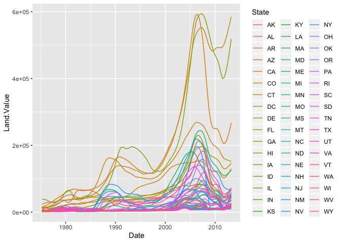
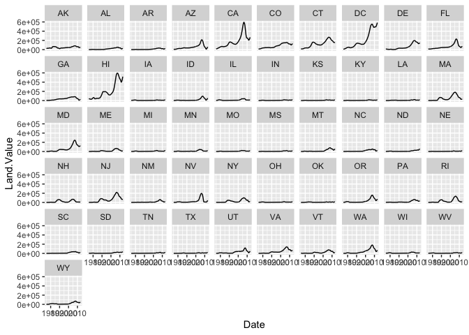

Exercise 4: Data visualization with ggplot
================

To start, first load all the required package with the following code. Install them if they are not installed yet.

``` r
library(tidyverse)
library(knitr)
```

Trend in land value
-------------------

This excercise uses a dataset that describes the trend of land value (`Land.Value`), among other variables, in different states in the US 1975-2013. The states are grouped into four different regions, under the variable `region`.

<br>

#### 1. First, load data. Also, **hide the `head(economics)` output but keep the code**.

``` r
housing <- read_csv("../datasets/landdata_states.csv") ## Edit this
head(economics) ## Hide the output of this
```

<br>

#### 2. Plot the trend of land values in all states in the same plot and assign a different color to each state.



<br>

#### 3. Use facetting to plot each state in a different plot, as the following.



<br>

#### 4. When should we use aesthetic mapping, and when should we use facetting? Please answer this question in the context of this exercise. *(6 pts)*

Answer: <span style="color:blue"> Write your response here. </span>
