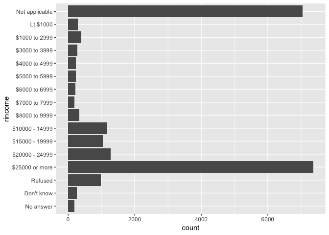

Lesson 9: Relational data
================

<br>

## Readings

#### Required:

[Chapter 13 in ‘R for Data
Science’](https://r4ds.had.co.nz/relational-data.html) by Hadley
Wickham & Garrett Grolemund

Jenny Bryan’s [STAT545 Chapter 10: Be the boss of your
factors](https://stat545.com/multiple-tibbles.html)

<br>

#### Other resources:

Jenny Bryan’s [STAT545 Chapter 14 When one tibble is not
enough](https://stat545.com/multiple-tibbles.html)

[Chapter 15 in ‘R for Data
Science’](https://r4ds.had.co.nz/factors.html) by Hadley Wickham &
Garrett
    Grolemund

## Learning objectives

## Setup

``` r
library(tidyverse)
```

    ## ── Attaching packages ─────────────────────────────────────────────────────────────────────────────────────────────────── tidyverse 1.2.1 ──

    ## ✔ ggplot2 3.0.0     ✔ purrr   0.2.5
    ## ✔ tibble  1.4.2     ✔ dplyr   0.7.6
    ## ✔ tidyr   0.8.1     ✔ stringr 1.3.1
    ## ✔ readr   1.1.1     ✔ forcats 0.3.0

    ## ── Conflicts ────────────────────────────────────────────────────────────────────────────────────────────────────── tidyverse_conflicts() ──
    ## ✖ dplyr::filter() masks stats::filter()
    ## ✖ dplyr::lag()    masks stats::lag()

## Introduction

From R4Ds

It’s rare that a data analysis involves only a single table of data.
Typically you have many tables of data, and you must combine them to
answer the questions that you’re interested in. Collectively, multiple
tables of data are called relational data because it is the relations,
not just the individual datasets, that are important.

### Types of data combination

Bryan’s <https://stat545.com/multiple-tibbles.html>

To work with relational data you need verbs that work with pairs of
tables. There are three families of verbs designed to work with
relational data:

Mutating joins, which add new variables to one data frame from matching
observations in another.

Filtering joins, which filter observations from one data frame based on
whether or not they match an observation in the other table.

Set operations, which treat observations as if they were set elements.

## Keys

## Types of joins

The most commonly used join is the left join: you use this whenever you
look up additional data from another table, because it preserves the
original observations even when there isn’t a match. The left join
should be your default join: use it unless you have a strong reason to
prefer one of the others.

Another way to depict the different types of joins is with a Venn
diagram:

## Part 2: Factors in R

Do we need to cover variable types? Classes

Tibbles

When working with factors, the two most common operations are changing
the order of the levels, and changing the values of the levels. Those
operations are described in the sections below.

css example It does not have droplevels()

Jenny’s factor chapter? Could also do the Stat545 example lifelevel
Exercise

Something like these questions either for gapminder or gss for exercise

Explore the distribution of rincome (reported income). What makes the
default bar chart hard to understand? How could you improve the plot?

What is the most common relig in this survey? What’s the most common
partyid?

Which relig does denom (denomination) apply to? How can you find out
with a table? How can you find out with a visualisation?

``` r
gss_cat
```

    ## # A tibble: 21,483 x 9
    ##     year marital     age race  rincome   partyid   relig   denom   tvhours
    ##    <int> <fct>     <int> <fct> <fct>     <fct>     <fct>   <fct>     <int>
    ##  1  2000 Never ma…    26 White $8000 to… Ind,near… Protes… Southe…      12
    ##  2  2000 Divorced     48 White $8000 to… Not str … Protes… Baptis…      NA
    ##  3  2000 Widowed      67 White Not appl… Independ… Protes… No den…       2
    ##  4  2000 Never ma…    39 White Not appl… Ind,near… Orthod… Not ap…       4
    ##  5  2000 Divorced     25 White Not appl… Not str … None    Not ap…       1
    ##  6  2000 Married      25 White $20000 -… Strong d… Protes… Southe…      NA
    ##  7  2000 Never ma…    36 White $25000 o… Not str … Christ… Not ap…       3
    ##  8  2000 Divorced     44 White $7000 to… Ind,near… Protes… Luther…      NA
    ##  9  2000 Married      44 White $25000 o… Not str … Protes… Other         0
    ## 10  2000 Married      47 White $25000 o… Strong r… Protes… Southe…       3
    ## # ... with 21,473 more rows

``` r
# View(gss_cat)


ggplot(gss_cat) +
  geom_bar(aes(rincome)) +
  coord_flip()
```

<!-- -->

``` r
# Make the plot
```

``` r
ggplot(gss_cat) +
  geom_bar(aes(rincome)) +
  coord_flip()
```

<!-- -->
